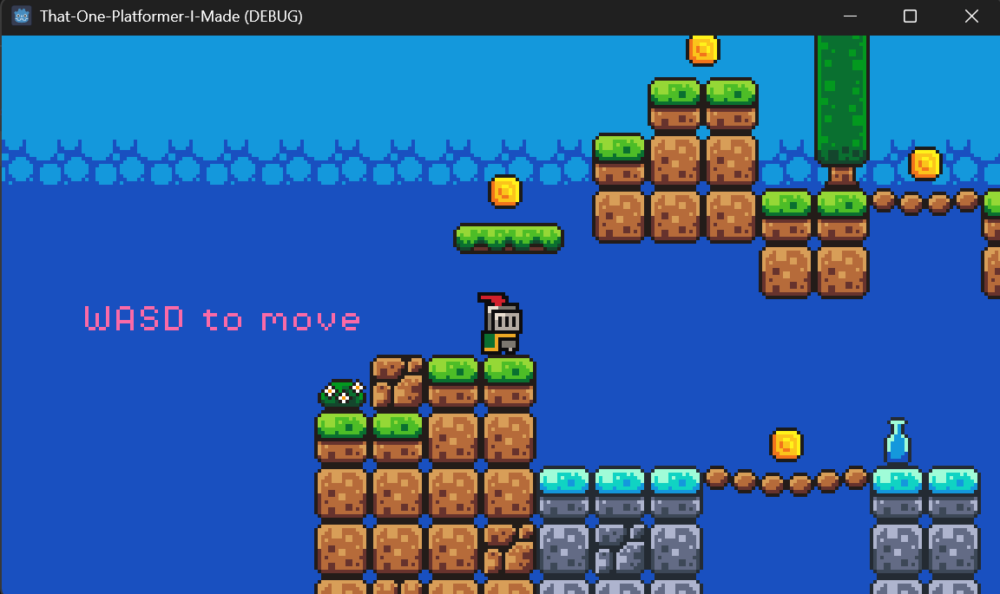
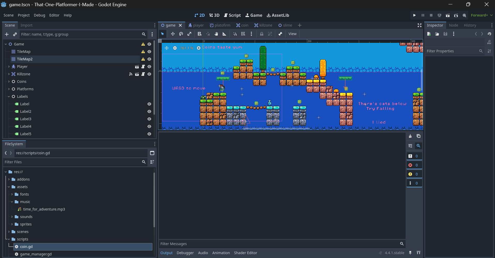

<h1 align="center">
  <br>
  
  <br>
  That One Platformer I Made
  <br>
</h1>

<h4 align="center">A chaotic little pixel-art platformer built in Godot 4 — jump, dodge, and collect coins while vibing to free retro tunes 🎮✨</h4>

<p align="center">
  <a href="./LICENSE">
    
  </a>
  <a href="https://github.com/Vic-41148/That-One-Platformer-I-Made/issues">
    
  </a>
  <a href="https://github.com/Vic-41148/That-One-Platformer-I-Made/stargazers">
    
  </a>
  <a href="https://github.com/Vic-41148/That-One-Platformer-I-Made/network/members">
    
  </a>
  <a href="https://www.linkedin.com/in/adityashibu41148/">
    
  </a>
</p>

<p align="center">
  <a href="#overview">Overview</a>
  •
  <a href="#features">Features</a>
  •
  <a href="#installation">Installation</a>
  •
  <a href="#controls">Controls</a>
  •
  <a href="#screenshots">Screenshots</a>
  •
  <a href="#assets--credits">Assets & Credits</a>
  •
  <a href="#structure">Structure</a>
  •
  <a href="#license">License</a>
</p>

---

## 🎮 Overview
**That One Platformer I Made** is a fun little **2D pixel-art platformer** created in **Godot 4**.  
Originally made as part of a **tutorial project**, it turned into something surprisingly enjoyable — complete with smooth controls, satisfying jumps, and a retro vibe.

You can run, jump, collect coins, and face off against colorful slimes across cute levels, backed by free-to-use sounds and music.

---

## ✨ Features
- 🧍‍♂️ **Playable Knight Character** with smooth movement and jump physics  
- 🪙 **Collectible Coins & Fruits** for that classic reward feel  
- 👾 **Enemies** — simple AI slimes that make you watch your step  
- 🎵 **Background Music & Sound FX** (all royalty-free)  
- 🎨 **Pixel-Art Aesthetic** using free open-source assets  
- ⚙️ **Lightweight & Fast** — runs even on potato PCs  
- 🧱 **Built with Godot 4** and entirely open source  
- 💾 **Includes Windows executable** in [Releases](../../releases)  

---

## 🛠️ Installation

### Option 1 — Play the Windows Build
1. Go to the **[Releases](../../releases)** section.  
2. Download the latest `.zip` build.  
3. Extract it and run `That-One-Platformer-I-Made.exe`.

### Option 2 — Run from Source
```bash
# Clone the repository
git clone https://github.com/Vic-41148/That-One-Platformer-I-Made.git
cd That-One-Platformer-I-Made

# Open project in Godot 4
godot4 .
````

---

## 🎮 Controls

| Action        | Key       |
| ------------- | --------- |
| Move Left     | ← / A     |
| Move Right    | → / D     |
| Jump          | Space / W |
| Restart Scene | R         |
| Quit Game     | Esc       |

---

## 🖼️ Screenshots & Demo

<p align="center">
  <br>
  <em>Gameplay — jump, collect coins, and dodge slimes!</em>
</p>

<p align="center">
  <br>
  <em>Developed in Godot 4 with clean, modular scene setup.</em>
</p>

<p align="center">
  <br>
  <em>Live gameplay demo — see the knight in action!</em>
</p>

---

## 🎵 Assets & Credits

All assets used in this project are **free to use**, either under public domain or permissive open licenses.

| Type    | Source / Credit                               |
| ------- | --------------------------------------------- |
| Fonts   | PixelOperator8 by Zacchary Dempsey-Plante     |
| Music   | “Time for Adventure” — Free license           |
| SFX     | Coin, Jump, Power-Up, Hurt — free CC0 sounds  |
| Sprites | Platformer pack assets (open source tutorial) |

> 📝 This project was created for **learning purposes** while following a Godot tutorial — but later expanded with personal tweaks, bug fixes, and a little extra polish.

---

## 🧱 Structure

```
That-One-Platformer-I-Made/
├── assets/
│   ├── fonts/
│   ├── music/
│   ├── sounds/
│   └── sprites/
├── scenes/
│   ├── game.tscn
│   ├── player.tscn
│   ├── coin.tscn
│   └── slime.tscn
├── scripts/
│   ├── player.gd
│   ├── coin.gd
│   ├── game_manager.gd
│   └── slime.gd
├── readme-files/
│   ├── screenshot-gameplay.png
│   └── screenshot-godot.png
├── export_presets.cfg
├── project.godot
└── README.md
```

---

## 📝 License

This project is distributed under the [MIT License](LICENSE).
You’re free to use, modify, and build upon it — attribution appreciated!

---

## 📬 Contact

**Aditya Shibu**
[LinkedIn](https://www.linkedin.com/in/adityashibu41148/)
✉️ [adityashibu41148@gmail.com](mailto:adityashibu41148@gmail.com)

Project Link: [https://github.com/Vic-41148/That-One-Platformer-I-Made](https://github.com/Vic-41148/That-One-Platformer-I-Made)

---
